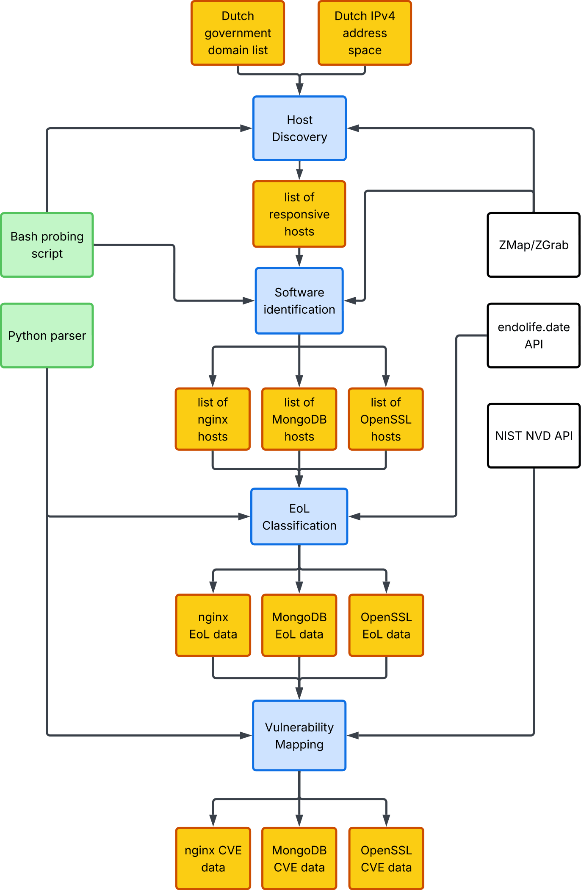

## Introduction

This repository contains code for the [Research in Cyber Security (CS4710)](https://studyguide.tudelft.nl/courses/study-guide/educations/14429) course at Delft University of Technology (Netherlands, EU). We investigate the prevalence of end-of-life software out in the wild and its impact on security. In particular, we focus on uncovering end-of-life Nginx, MongoDB, and OpenSSL versions used in the Netherlands.

## Methodology

We use the open-source network measurement tools offered by [The ZMap Project](https://zmap.io/), namely ZMap, ZGrab, and ZTee. The process we follow is outlined in [this readme](https://github.com/zmap/.github/blob/main/wiki/getting-started-with-zmap-and-zgrab2.md). This repository helps orchestrate this process so that it remains transparent and reproducible to aid our research endeavours. The Netherlands IP ranges used throughout this study were obtained from [ScaniteX](https://scanitex.com/en/resources/ip-ranges/nl/download/cidr). An overview of our entire pipeline can be found below:



## How to Run

For reproducibility, we set everything up so that it can be run from within a single Docker container. Run the following commands in order to get started:

1. Build the Docker image:
```bash
docker build -t hack-lab .
```

2. Run the container:
```bash
docker run --rm -it \
    --name hack-lab \
    --network host \
    --cap-add NET_RAW \
    --cap-add NET_ADMIN \
    -v $(pwd):/workspace \
    hack-lab
```

3. From inside the container, run stage 1 (host discovery):
```bash
./scripts/scan-ports/scan-ports.sh
```
By default, this will scan port 80 on the IP ranges listed in `nl-cidr.conf`, using a bandwidth of 1 Mbps. These values can be freely configured by passing the relevant arguments to the script. After the script finishes, check the `data/scan-ports/` directory for results.

4. Run stage 2 (software identification):
```bash
./scripts/grab-banners/grab-banners.sh -i <PATH TO OUTPUT FILE FROM STAGE 1>
```
By default, this will send probes using 100 concurrent senders, configured with a 10 second timeout, to the hosts in the supplied input file. These values can be freely configured by passing the relevant arguments to the script. The script automatically processes the responses to the probes, and extracts software version information (if present), to an output csv located in `data/grab-banners/`.

5. Run stages 3 and 4 (EoL classification and vulnerability mapping):
```bash
python3 data/processing/parser.py --input <PATH TO SCAN RESULTS DIRECTORY>
```
This will iterate through all scans in the input directory, remove duplicates, and identify whether the observed software versions are EoL using endoflife.date. Afterwards, it will map software versions to CVEs using NIST-NVD. After the parser finishes, check the `data/processing/results` directory for software product aggregate results, CVE information, and auto-generated graphs.